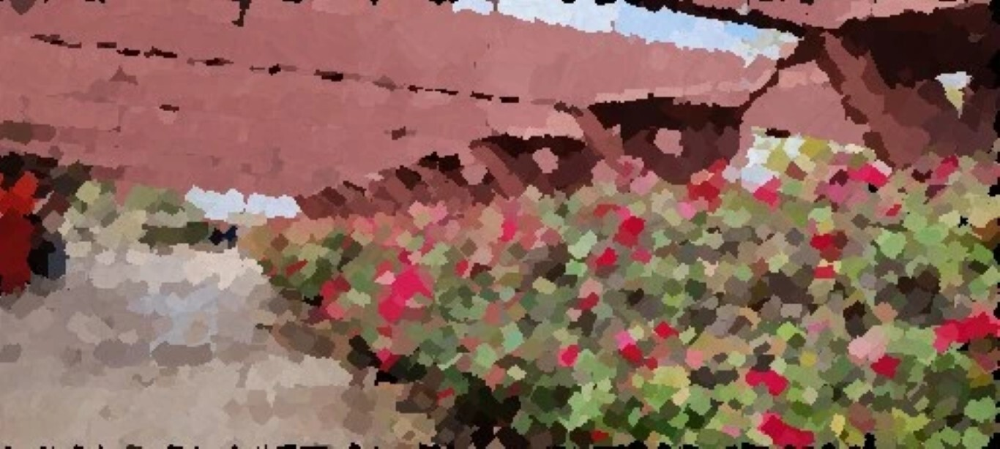

# ColourlessTransformer

ColourlessTransformer is a simple interface for Paint Transformer, a neural network that performs *Feed Forward Neural Painting with Stroke Prediction*.

## Demo
| Original                   |                             |
|----------------------------|-----------------------------------------------------------------------------------------|
| PaintTransformer           |  |
| PaintTransformer Animation |                |

## Authors

Interface by [@ColourlessSpearmint](https://github.com/ColourlessSpearmint).

PyTorch implementation by [@Huage001](https://github.com/Huage001)

Original paper by Songhua Liu, Tianwei Lin, Dongliang He, Fu Li, Ruifeng Deng, Xin Li, Errui Ding, and Hao Wang

## Prerequisites

- PyTorch
- Numpy
- Pillow
- Streamlit

## Usage

1. Clone the repository:

```bash
git clone https://github.com/ColourlessSpearmint/ColourlessTransformer.git
```
2. Navigate into project directory:

```bash
cd ColourlessTransformer
```

3. Run the install.bat file to install the required dependencies:
```bash
./install.bat
```

4. (optional) If you lack a CUDA-enabled GPU, install the CPU version of PyTorch:

```bash
pip uninstall -y torch torchvision
pip install torch torchvision
```

### Streamlit

To use the Streamlit app, run any of the following commands:

- ```streamlit run app.py```
- ```./start_streamlit.bat```
- ```python start_streamlit.py```

### Drag-Drop

You can also drag and drop your images onto painttransformer.bat. Your images will be processed automatically and saved to the directory of the input files.

## License

ColourlessTransformer is licensed under the [Apache 2.0 License](https://www.apache.org/licenses/LICENSE-2.0).
